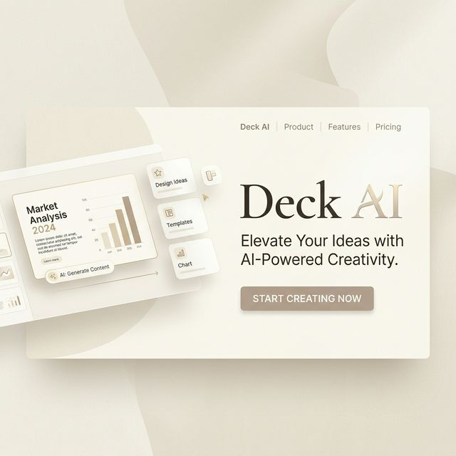

<div align="center">
  

  <br />
  
  # **Deck AI**
  **The 10x Paradigm Shift in Desktop Publishing**

  [](https://opensource.org/licenses/MIT)
  []()
  []()
  []()
</div>

---

<details open>
  <summary><b>📖 Table of Contents</b></summary>
  <ol>
    <li><a href="#vision">Vision</a></li>
    <li><a href="#core-features">Core Features</a></li>
    <li><a href="#architecture">Architecture</a></li>
    <li><a href="#quick-start">Quick Start</a></li>
    <li><a href="#contributing">Contributing</a></li>
  </ol>
</details>

---

<h2 id="vision">🌌 Vision</h2>

We are tearing down the archaic barriers of manual document formatting. **Deck AI** empowers you to build breathtaking, pixel-perfect presentations and documents at the speed of thought. By orchestrating advanced AI agents mathematically constrained to flawless layouts, we guarantee a 1:1 translation of human intent into stunning, unbounded creativity—without ever dragging a text box again.

---

<h2 id="core-features">✨ Core Features</h2>

- **Absolute Layout Guarantees (Zero Broken Elements)**: Deep headless-validation guarantees text and images never bleed out of boundaries.
- **Frictionless Steering**: Lasso elements on the canvas and natural-language prompt the AI for granular design mutations.
- **Dual-Environment Topologies**: Run the agent harness via Google Cloud Run, or completely locally using **OpenRouter** for maximum privacy.
- **Platform-Agnostic Exports**: High-fidelity PDF (`A4`) and native editable `.pptx` (`16:9`).

---

<h2 id="architecture">🏗️ Architecture</h2>

Our workspaces are strictly decoupled:
* **`/agent`**: The *opencode harness* fork doing heavy LLM reasoning, DOM checks, and context management.
* **`/frontend`**: Vite + React + TypeScript powering the UI and Canvas steering.
* **`/backend`**: Node.js/Express handling routing.
* **`/deploy`**: Docker and cloud infrastructure topologies.
* **Database Layer**: **Prisma + SQLite** (Provides beautiful *Prisma Studio* visual admin, 100% local/cloud parity, zero heavy setup).

For total details, view our `/documentation` folder.

---

<h2 id="quick-start">🚀 Quick Start</h2>

```bash
# Clone the repository
git clone https://github.com/your-org/deckai.git
cd deckai

# Launch the Visual Database (Prisma Studio)
cd backend && npx prisma studio

# Start the frontend
cd ../frontend && npm run dev
```

---

<h2 id="contributing">🤝 Contributing</h2>

We uphold a rigorous standard for code merging. Please review [CONTRIBUTING.md](./CONTRIBUTING.md) for our strictly enforced 6 Engineering Paradigms (DRY, API First, Issue Planning, Clear Data, Unified Schema, Agent Usable). 

> **Important**: Pull Requests can *only* be approved by **@Zacxxx**. Unapproved merges are strictly blocked.
